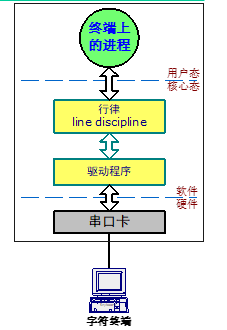
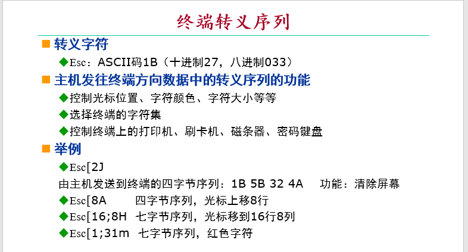
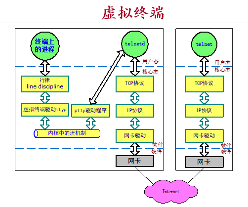
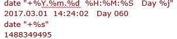
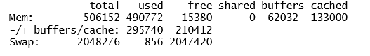
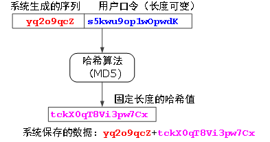
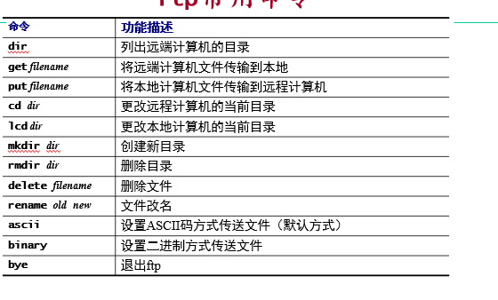

# 终端

终端由键盘，显示器和**RS232串行通信接口构成**，作为交互式输入输出设备与主机连接，一台主机可以连接多台字符终端

**终端只是传输字符流的设备**

**RS232电缆的长度限制**

* 早期要求小于10米

* 现在可达百米

主机与终端的连接如下



## 行律

是一个程序，终端的上行字符流和主机的下行字符流均需通过行律

### 作用

* 一行内字符的**缓冲、回显与编辑**，直到按下回车键
* 数据加工，如：将\n转化为\r\n
* 控制：将Ctrl-C字符等控制字符转化为信号(signal)

### 调整

行律的功能可以通过编程方法调整，相关命令有··`stty`

如`stty erase ^H`,`stty -a`

### 终端转义序列（这谁记得住）



## 终端类型

不同的终端类型定义了一组转义序列以及相对应的操作，如ansi,vt100,vt220

#### 主机与终端的类型匹配

主机根据终端类型，实现相应功能时发送对应的控制码；当终端类型不对时，可能全屏幕操作失败

通过转义序列还可以控制终端上的打印机、光笔、刷卡机、磁条器、密码键盘

## 流量控制

### 必要性

* 终端的显示速度跟不上主机的发送速度
* 主机送来数据终端需要打印出来，但打印速度慢
* 主机送来的显示内容，需暂停显示，仔细分析
* 需要一种机制控制主机方向来的数据流量

### 方法

**硬件方法**：RS232接口的CTS信号线（Clear To Send）

**软件方法**：利用流控字符Xon和Xoff

## 仿真终端

运行仿真软件来模拟终端，如Powershell

## 虚拟终端

UNIX主机与PC机通过网络相连，客户端运行telnet，服务器端telnetd，成为UNIX的一个基于TCP通信的虚拟终端
**安全终端**，在TCP连接上加密和压缩数据，如：Windows客户端软件PuTTY，SecureCRT



# 账户及基本操作


* 系统管理员可以使用`useradd`命令创建用户

  ```bash
  useradd [-mMnr][-c <备注>][-d <登入目录>][-e <有效期限>][-f <缓冲天数>][-g <群组>][-G <群组>][-s <shell>][-u <uid>][用户帐号]
  
  useradd -D [-b][-e <有效期限>][-f <缓冲天数>][-g <群组>][-G <群组>][-s <shell>] #这是变更预设值时用的
  ```

  例如

  ```bash
  useradd name #添加普通用户
  useradd -g root name # 添加到用户组
  useradd -r name #添加系统用户
  useradd -d /home/myd tt# 为新添加的用户指定home目录
  useradd caojh -u 544# 建立用户且制定ID
  ```

* 登录成功后会出现Shell提示符，如

  ```bash
  $   Bourne Shell (/bin/sh)
  %  C Shell      (/bin/csh)
  $   Korn Shell   (/bin/ksh)
  #  当前用户为超级用户root（操作时要小心）
  ```

* 关机前需要执行`shutdown`命令（仅特权用户有权限）

# 联机手册及命令

## `man`命令

是`manual`的缩写，即使用手册，可以查看多个命令的详细信息，如

```bash
man cat #可以查看cat命令的详解
man strccpy #可以查看C语言中该函数的详解
```

对于一个*name*，要区分它是哪种类型，可以加上章节编号，其中：

* 1：命令
* 2：系统调用
* 3：库函数

例如`man strcpy`也可以这样查询，`man 3 strcpy`

也可以进行模糊查找，使用`-k`，例如

```bash
man -k str
```

会将所有带“str”的手册都列举出来

## `date`命令

读取系统时间，可以指定输出格式



1488349495指的是从UTC1970开始过了多少秒

### npdate

通过ntp协议校准时间

```bash
ntpdate 0.pool.ntp.org #设置时间，必须root用户
ntpdate –q 0.pool.ntp.org #查询时间，普通用户也可以
```

## 其他系统命令

* who ：列出当前已登录系统的用户

* tty：可以打印出当前终端的设备文件名

* who am i/whoami：查询当前终端的登录用户

* uptime：

  * 系统自启动后到现在的运行时间（年龄）

  * 当前登录入系统的用户数

  * 近期1分钟，5分钟，15分钟内系统CPU的负载（平均调度队列长度）

* w:

  * 列出终端的空闲时间（IDLE）
  * JCPU：终端上正在运行的作业占用的CPU时间（包括前台程序和后台程序）
  * PCPU：终端上正在运行的前台程序占用CPU时间
  * WHAT列出终端上的用户正在执行什么命令

* sar（system activity report） : 打印系统活动报告

* top：

  * VIRT进程逻辑地址空间大小(virtual)
  * RES驻留内存数(Resident),也就是占用物理内存数
  * SHR与其他进程共享的内存数(Share)
  * %CPU 占用CPU百分比
  * %MEM占用内存百分比

* free：检查系统内存使用情况

  

  * 第一行：内存总数 506MB,已使用490MB, 空闲15MB

       Linux为提高效率利用程序不用的内存缓冲磁盘信息，当前有62MB的buffer和133M的cache

  * 第二行：不计buffers/cache,程序用掉了295MB,有210MB空闲
  * 第三行：打印了磁盘Swap区的使用情况

* passwd：更改密码，root用户可以修改其他用户的密码，`root name`

  保存方式为：

  

  保存在/etc/passwd，/etc/shadow

* telnet/ssh：远程登录

* ftp：文件传送`ftp ip`

  

* cal：打印日历 `cal  [ [month] year]`,如`cal 10 2022 `，打印2022年10月的日历

* bc：启动计算器，默认精度小数点后0位，可在启动时使用参数，`bc -l`使其精度变为小数点后20位

  可以通过·`scale`设置小数点位数，如`scale(10000)`

# VNC（Virtual Network Computing）

远程桌面

# Samba服务：

使得Windows可共享Linux磁盘
