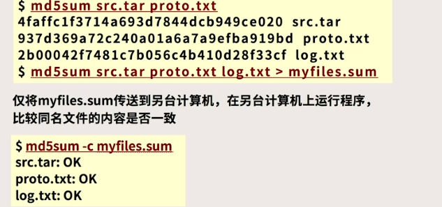
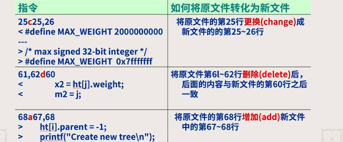
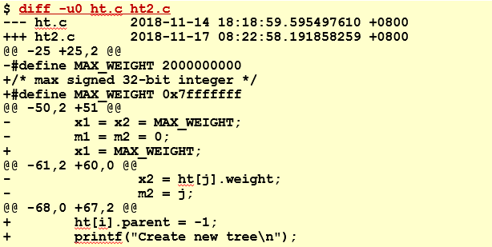
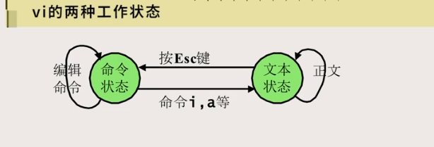
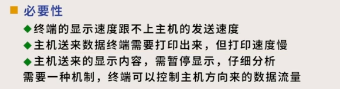
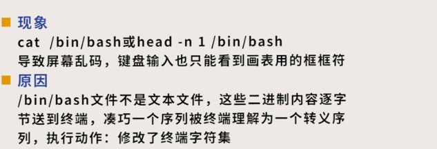
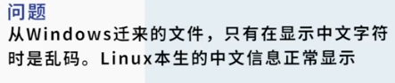
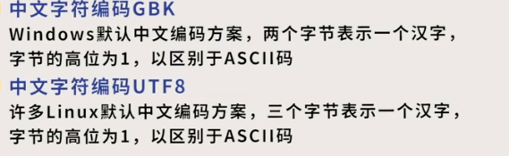

# 文件比对

## cmp

两文件逐字节比较

```bash
cmp f1 f2
```

如果不同，会打印出第一个不同的位置

WINDOWS下是`COMP`

## 散列算法

### md5sum/shalsum

使用MD5算法，根据文件内容生成16字节hash值来进行比较

后者使用SHA-1算法，生成20字节hash值

### sha512sum

生成512字节

**例**



可以检验不同主机文件是否被改过

### 失误率

MD5：2^-128，即不同文件的哈希值相同的可能

## diff

求两个文件的差别

```bash
dif f1 f2  #正常输出格式（normal），如第一个文件怎么才能变成第二个文件
diff -u f1 f2# unified
```

**通常输出格式**




**unified输出格式**

默认输出上下相同的三行，如不需要改成`-u0`



## 版本管理系统

* 1975 SCCS
* 1986 CVS
* 2001 SVN
* 2005 GIT

### 基本功能

对一个目录树下的文本文件进行版本管理，保存当前的快照

# 文本文件的编辑

配置文件放在用户home目录下.exrc，记作`$HOMO/.exrc`

**常用配置**

* set number 每行左边显示行号
* set tabstop 制表符为4格对其

**vi工作状态转化**



* 通过`:`引入行编辑和查找命令

## 常见命令

* a：在光标右侧追加内容

* h,j,k,l：左移，下移，上移，下移，可以在命令前跟数字表示执行多少遍（一遍移动一行）

* ctrl-b：向后翻页，可用`PgDn`代替

* ctrl-f：向前，可用`PgUp`代替

* ^：移动到行首

* $：行末尾

* w：向右移动一个单词

* b：向左

* :4 定位到476

* :$ 定位到最后一行

* . 表示当前行号

* %：移到配对的括号上

* x：删除当前字符

* dd：删除当前行

* r：替换当前字符

* u：取消操作

* `.`：可以重复上一次操作

* ZZ：存盘退出

* `:wq`：同上

* `:w`：存盘不退出

* `:q!`：不存盘退出

* `:r`：读入文件插入到当前行之下

  ```bash
  :r x.c
  ```

* 写文件

  ```bash
  :50,$w f1 #把第五十行至文件尾的内容写到f1中
  ```

* 删除并拷贝到剪切板

  ```bash
  :10,50d #删除10到50行
  :1,.d 3删除文件收到当前行
  ```

* 不删除拷贝

  ```bahs
  :10,50y
  ```

* 粘贴：`p`

* 复制

  ```bash
  :5,10co56#把5到10行复制到56行之下
  :8,34m78 # 移动到78行之下
  ```

* J: 当前行与下一行合并

* ctrl-L：刷新

* ctrl-G：显示信息

* 模式查找

  使用正则表达式的模式，以`/`开头

  * n:向下查找下一个
  * N：向上查找上一个

* 替换

  ```bash
  :n1,n2s/pattern/string/g#不加g，每行只替换一遍，加g将所有都替换
  :50,80s/^/    /   #(四个空格) 右移四列
  :50,80s/^    //   #左移四列
  :1,$s/ *$//       #消除尾部多余的空格
  ```

  **注意转义符的使用**

  **可以用`:`或者`^`代替匹配规则的斜线，没必要遇到斜线都加转义符**

## 死机问题

**例：使用vi存盘后屏幕卡死**

可能原因：按了`Ctrl-S`，使得linux进入流量控制状态，这时按下`Ctrl-Q`即可解除

产生原因：

* 物理终端：

  使用RS232接口连接主机和终端

  流量控制必要性：

  

  RS232的控制方法：

  * 硬件方式：CTS信号线，需要电缆中专门增加通信线
  * 软件方式：使用流控字符`Xon`和`Xoff`，分别对应ctrl-S和ctrl-Q，ascii码为17和19，即字母对应的顺序

* 网络虚拟终端：
  * 使用tcp协议
  * tcp有流量控制功能，无需上述机制，但是保留了下来

## 意外终止

**现象**：vi编辑存盘后，程序终止，编辑成功丢失

**原因**：按下了`Ctrl-Z`,导致当前进程被挂起，使其处于stop状态

**解决方法**：使用作业管理机制

```bash
jobs # 列出当前被挂起的进程
%1 #将1号作业恢复到前台运行，即获取键盘和终端使用
fg %1 #同上
```

## 退格键无法使用

运行自己写的程序时回退键无法使用

**原因**：行律设置不正确

**解决方法**：回退键对应`Ctrl-H`，可以执行`stty erase ^H`，即把ctrl-H和回退都设置为回退键，也可以将其写入`$HOME/.bash_profile`

## 显示乱码问题




终端一般使用ascii字符集

**解决方法** ：断开连接重新登陆，注意不要查看非文本文件

## 文本文件格式问题

现象：linux编写的文本文件在windows下打开都放在一行内

原因：存储格式不同

解决方法：在linux下完成格式转换再用windows，使用`dos2unix`/`unix2dos`命令，可以先使用`file`命令查看文件属性

**格式区别**：

* linux行尾是`\n`，windows行尾是`\r\n`

## 中文编码问题



原因：gbk和utf-8编码不兼容



linux下`LANG`这个环境变量应为`en_US.UTF-8`，可以使用`env | grep LANG`来检查，如果不对，使用命令`export LANG=en.US.UTF-8`来设置

**`iconv`**:中文字符编码转化

```bash
iconv -f gbk -t utf-8
iconv -f gbk -t utf-8
```