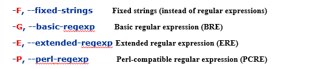

# 单字符匹配

* 非特殊字符与自身匹配，如a与a，b与b
* 转义字符：例：`\*`与`*`匹配
* 圆点（.）：可以匹配任何字符

## 定义集合

* 远点，星号，反斜线在方括号内是，代表他们自己
* [abcd]可以匹配a,b,c,d

### 用减号代表区间

* [a-z]代表匹配a到z的小写字母
* [a-aA-Z0-9]：也可这样组合
* 减号在最后，则失去了表示区间的意义，只表示匹配`-`

### 用^表示补集

如：`[^a-z]`表示匹配非小写字母

但也不能写到最后，类似减号

## 单字符正则表达式的组合

### 串结

如`abc`可以匹配abc，[A-Z].[0-9]·可以匹配AA00

### 星号

表示星号前的规则可以出现0到任意次

如`12*4`可以匹配12222224

### 锚点

* `$`:在为不是表示匹配行尾的串，否则就表示自身`$`
* ^：在首部时匹配行首的串，否则表示自己

# 扩展的正则表达式

* 分组：圆括号（），如(xy)*，匹配xy,xyxy,xyxyxy
* 使用`|`表示逻辑或
* 加号：表示1到多次重复
* 问号：0次或一次
* 限定重复次数
* [[:xdigit:]]：十六进制数字
* \d：数字
* \D：非数字
* 更多锚点

# 相关命令

## 筛选

### grep：在文件中查找字符串

使用普通的正则表达式规则

eg.

```bash
grep '[0-9][0-9]*'  shudu.c
```

现在linux中的grep支持多种模式



**可选参数**

* -n:显示行数
* -v:显示所有不包含模式的行
* -i：忽略大小写

### egrep:使用扩展的正则表达式


### fgrep：快速搜索指定字符串

以字符串来搜索而不是模式

## 流编辑（sed）

**用法**：

* sed '命令' 文件名列表
* sed –e '命令1' –e '命令2' –e '命令3' 文件名列表
* sed -f 命令文件  文件名列表

### 正则表达式替换

```bash
's/被替换内容/替换内容/g'
```

**增加`\(`和`\)` **

可以表示规则中的第几个部分 ，例如

```bash
s/\([a-zA-Z_][a-zA-Z0-9_]*\)->number/\1->num/g
```

其中`\1`代表`\([a-zA-Z_][a-zA-Z0-9_]*\)`

# 复杂筛选及加工（awk）

名字来源是三个发明者的姓氏的第一个字母

**用法**

* awk '程序' 文件名列表
* awk -f '程序' 文件名列标

其中，程序包括 `条件 {动作}`

可以使用逻辑运算（类似C语言），正则表达式

**特殊的条件**：end:全部结束后操作

​						begin

​						空：对所有行匹配

例如

```bash
ps -ef | awk '/guest/{printf("%s ",$2);}'
```

其中$2表示第二列，/guest表示正则表达式匹配